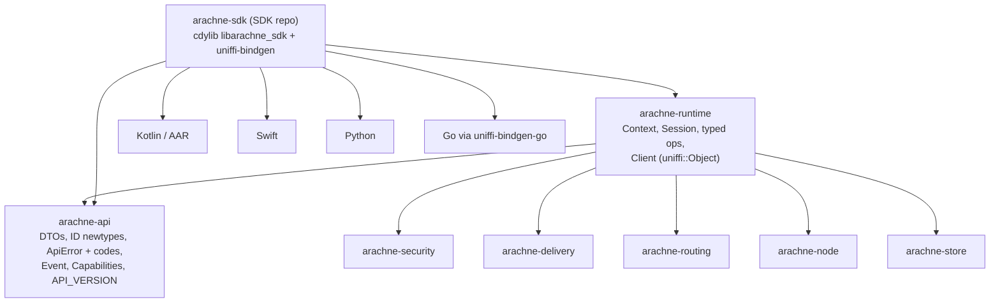
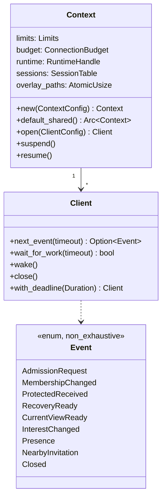
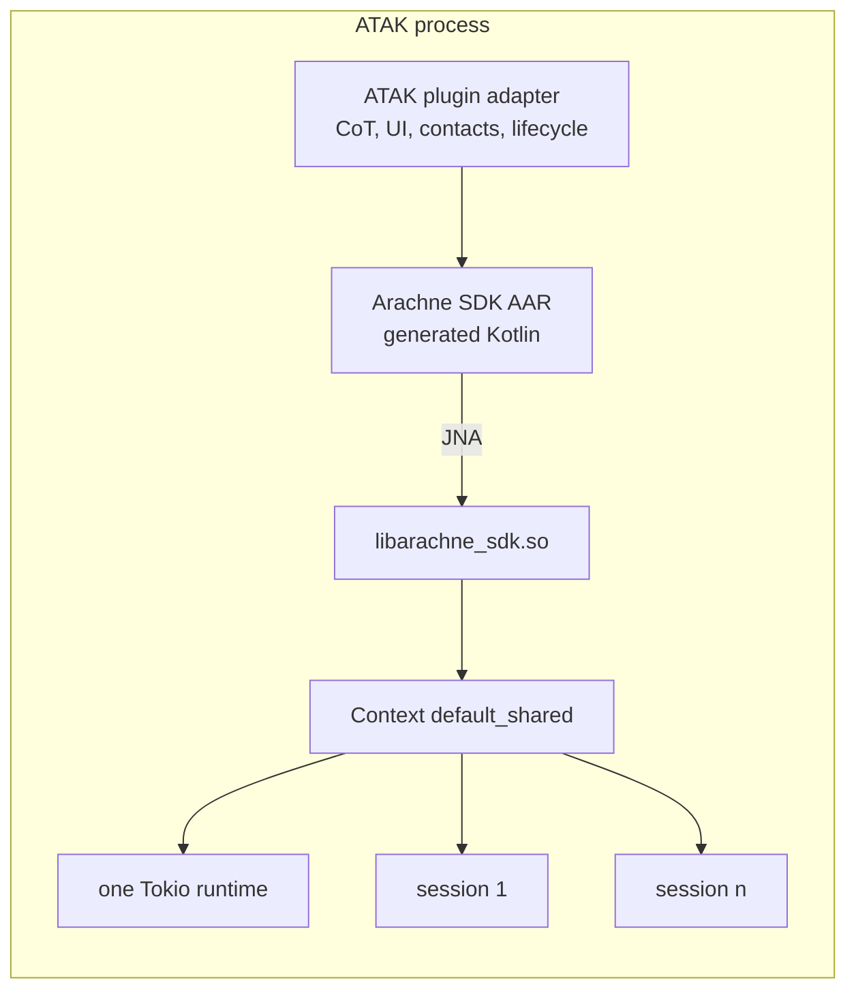
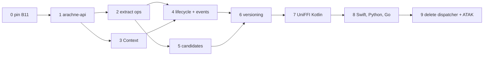

> Written by Claude (AI). Status: Proposed.

# ADR: One typed SDK contract and an owned runtime context (A1, A4, part of A5)

Date: 2026-09-24. Base: core `origin/main` b06a72d. SDK: `arachne-sdk` `origin/main` and `origin/feat/kotlin-sdk`.
Inputs: [architecture review](2026-09-24-architecture-review.md) (A1, A4, A5),
[work tracker](2026-09-24-work-tracker.md) (ATAK readiness table), and
`arachne-sdk/docs/android-consumer-plan.md`.

## BLUF

- Make a new crate, `arachne-api`. It holds all public request and result types, ID newtypes,
  one error enum with stable numeric codes, and `API_VERSION`. It is the single source of truth.
- The typed `Client` calls the session logic directly. It does not build JSON. The private JSON
  dispatcher (`enum Request`, `execute`, `execute_stored`) goes away when the last op moves.
- Generate the Kotlin, Swift and Python bindings with **UniFFI in proc-macro mode**. Generate Go
  with `uniffi-bindgen-go`. Pin UniFFI **0.31.x** for all four, because the Go generator
  (v0.7.1, 2026-04-16) targets UniFFI 0.31.0. The latest UniFFI is 0.32.2 (2026-09-23).
- Replace the static `REGISTRY` with an owned `Context`: limits, connection budget, one shared
  Tokio runtime (or a runtime from the host), and the session table. The FFI uses a lazy default.
- Replace the lifecycle calls with `wait_for_work(timeout)`, `wake()`, `close(&self)`, per-op
  deadlines, `next_event(timeout) -> Event`, and `suspend()`/`resume()`.
- Candidates become opaque objects. Each one is bound to its kind and its client, and you can use it
  one time only. Core does save, read back and adopt. Host-mode snapshot bytes go away (no legacy mode).
- In the ATAK process there is exactly one native library: `libarachne_sdk.so` from the SDK repo.
  `fabric-android` is removed.

## Context

### What exists today

- `crates/arachne-runtime/src/lib.rs:866` has a private `enum Request` with about 93 ops. It
  uses `#[serde(tag = "op", deny_unknown_fields)]`. `execute(handle, bytes)` parses JSON, runs the op,
  and returns JSON. `execute_stored` moves snapshot bytes into a second buffer and uses a
  hard-coded list of op names (`lib.rs:2505-2579`).
- All errors are `Result<_, String>`. `client.rs:1741` `map_error` guesses `ErrorKind` from
  substrings such as `"limit"`, `"peer"` and `"invalid"`. The SDK C ABI (`ffi.rs`) drops even that.
  It gives status 0, 1 or 2 plus text.
- `Client` (`client.rs:452`) has about 34 typed methods. Each method builds a `json!` value, calls
  `execute`, and parses the reply into `Raw*` structs. So the typed API is a JSON wrapper.
- The SDK bindings retype the DTOs by hand. Go `client.go` has 1,137 lines. Python `client.py` has
  1,129 lines. Swift `Client.swift` has 1,085 lines. Kotlin has 690 lines and uses JNA 5.17.0.
- `Network::Tor` exists only with the `tor` feature. There is no `#[non_exhaustive]`.
  `pub mod harness`, `InstallVerifiedPolicy`, `Publish` and `Poll` are fixtures, but they are public.
- `lib.rs:389` has `static REGISTRY` with a cap of 8 sessions. `create_endpoint` builds one
  2-worker Tokio runtime for each client (`lib.rs:559`). It keeps the registry lock during a bind
  of up to 10 s (B6). `cancel` is sticky. `wait_for_work` has no timeout. `Client::close` takes
  `&mut self`. One `WorkSignal` covers all queues.

### What the ATAK plan needs

| ATAK plan step | What this ADR gives |
| --- | --- |
| 1. One native library and one session owner | One `.so` (`libarachne_sdk`), one `Context`, one runtime |
| 2. Typed methods for ATAK workflows | Typed ops in `arachne-api`, generated into Kotlin |
| 3. Candidate safety through the C boundary | Opaque, kind-bound, client-bound candidate objects |
| 4. Distinct IDs and error categories through the ABI | ID newtypes and `ApiError` with `code()` |
| 5. End-to-end through AAR and ATAK host | `wait_for_work(timeout)`, `suspend`/`resume`, events |

## Decision 1: Binding strategy

### Options

| Criterion | A. UniFFI proc-macro | B. Hand C ABI + protobuf/flatbuffers | C. Keep JSON + JSON Schema |
| --- | --- | --- | --- |
| Source of truth | Rust types | `.proto` file | Rust types, then schema export |
| Kotlin, Swift, Python | Generated (upstream) | Generated message types; call layer by hand | Generated DTOs possible; call layer by hand |
| Go | `uniffi-bindgen-go` (NordSecurity, third party) | `protoc-gen-go` | Hand or codegen |
| Objects with identity (client, candidate) | Yes (`uniffi::Object`, `Arc<T>`) | No. Only integer handles | No. Only integer handles |
| Typed errors across the ABI | Yes (`uniffi::Error` becomes exceptions) | Manual error message | Manual |
| Hand-written FFI per language | None | About 300 lines per language | About 1,100 lines per language (today) |
| Cost of a new op | One Rust function | `.proto` + Rust + 4 call layers | Rust + 4 bindings |
| Risk | Version lock between generators; JNA on Android | Two type systems to keep in sync | Stays untyped at run time |

### Recommendation: Option A, UniFFI proc-macro mode

Reasons:

1. **One source of truth in Rust.** The DTOs are Rust structs with derives. No second IDL.
2. **Objects, not handles.** A `Client` and a candidate are `Arc<T>` objects. A foreign caller cannot
   make a candidate from bytes or give a candidate to the wrong client. This is ATAK plan gap 3.
3. **Typed errors.** `uniffi::Error` enums become Kotlin and Swift exception types and Python
   exception classes. We add `code()` so the numeric code also crosses the ABI.
4. **It removes about 4,400 hand-written lines.** It also fixes B10 by design, because generated code
   does not hold a binding-level lock around a blocking call.

Option B keeps handles and a hand call layer. It only moves the untyped part. Option C keeps the
present problem, which is that errors and shapes are checked only at run time.

### Constraints and risks

- **Version lock.** All generators in one release must use the same UniFFI minor version. Pin
  `uniffi = "=0.31.x"` in the workspace. Move to 0.32 only when `uniffi-bindgen-go` has a 0.32
  release. If Go blocks an upgrade that we need, ship Go one release later. Do not mix versions.
- **Android uses JNA.** Upstream UniFFI Kotlin uses JNA. It has no JNI backend. The SDK Kotlin
  binding already uses JNA 5.17.0, so the SDK does not change. The ATAK plugin moves from JNI
  (`fabric-android`) to JNA.
- **ATAK classloader.** Android lets only one classloader load a given `.so` in one process. If the
  ATAK host or another plugin already has `libjnidispatch.so`, a second load from the plugin
  classloader can fail. We cannot confirm what ATAK ships from here. Step 9 checks this: look in the
  host APK for `libjnidispatch.so` and `com.sun.jna`. If the host has them, use the host JNA as
  `compileOnly`. If not, the plugin ships JNA. Set the UniFFI `cdylib_name` so the library name is
  unique (`arachne_sdk`).
- **R8 shrinking.** `consumer-rules.pro` must keep the generated UniFFI package and the JNA classes.
- **`#[non_exhaustive]`.** It protects Rust callers. UniFFI does not carry it to Kotlin or Swift.
  The foreign rule is this: a new variant increments `API_VERSION`, and foreign code keeps an
  `else`/`default` branch. A spike in step 7 confirms that `#[non_exhaustive]` compiles on
  `uniffi::Enum` and `uniffi::Error` in 0.31.

### Where the annotations go

Put the derives on the `arachne-api` types behind a `uniffi` feature
(`#[cfg_attr(feature = "uniffi", derive(uniffi::Record))]`). Put `uniffi::setup_scaffolding!()` in
`arachne-api` and in `arachne-runtime` (for the exported `Client` object). The SDK cdylib depends on
both with `features = ["uniffi"]` and generates the bindings from its own library with
`uniffi-bindgen --library`. Core stays free of UniFFI when the feature is off. Library mode reads
the metadata of all crates in the cdylib, so this cross-crate layout is supported.

### Events: a blocking pull, not callbacks

Use `next_event(timeout) -> Option<Event>`. Do not use UniFFI callback interfaces or async for
version 1. A pull has no re-entrancy into foreign code. It does not keep foreign objects alive
across the classloader. It fits the current poll model.

## Decision 2: Crate layout



- **`arachne-api`** (new, `crates/arachne-api`). No I/O, no Tokio. It contains:
  - ID newtypes: `EndpointId`, `MemberId`, `WorkspaceId`, `RecordId`, `AttemptId`, `PublicationId`.
    Each one validates its length when you make it. You cannot mix them.
  - Request and result structs for each op, for example `CreateWorkspace` and `WorkspaceInfo`.
  - `ApiError` and `ErrorCode` (see decision 3), `Event`, `Capabilities`, `Network`,
    `pub const API_VERSION: u32`.
- **`arachne-runtime`** keeps the internals. Each arm of `execute_in_session` becomes a typed
  function `fn op_x(session: &mut Session, args: XArgs) -> Result<XReply, ApiError>` in a module for
  its subsystem (`ops/membership.rs`, `ops/delivery.rs`, and so on). This also starts A10.
  `Client` calls these functions directly.
- **The JSON dispatcher is removed.** There is no generated JSON layer. The debug rig's
  `ControlExchange` stays as a typed method behind a `debug-rig` feature. Release AARs never
  enable this feature. `rawCall` and `rawCallStored` are removed from the SDK. This follows the
  owner rule "no legacy modes".
- **Fixtures** (`harness`, `InstallVerifiedPolicy`, `Publish`, `Poll`) move behind a
  `test-fixtures` feature.

## Decision 3: Error model

```rust
#[non_exhaustive]
#[repr(u32)]
pub enum ErrorCode {
    Closed = 1, Cancelled = 2, DeadlineExceeded = 3,
    InvalidInput = 100, InvalidId = 101, WrongState = 102, Unsupported = 103,
    CapacityExceeded = 200, LimitReached = 201,
    StorageFailed = 300, StorageCorrupt = 301, CandidateStale = 302,
    PeerUnreachable = 400, Timeout = 401, TransportFailed = 402,
    NotAuthorized = 500, InvitationInvalid = 501, InvitationExpired = 502, NotMember = 503,
    EpochMismatch = 600, PolicyMismatch = 601,
    Internal = 900,
}

#[non_exhaustive]
pub enum ApiError {        // derive(thiserror::Error, uniffi::Error) with feature
    Closed, Cancelled, DeadlineExceeded,
    InvalidInput { field: String, reason: String },
    CapacityExceeded { resource: String, limit: u64 },
    Storage { code: ErrorCode, detail: String },
    Transport { code: ErrorCode, peer: Option<EndpointId>, detail: String },
    Authorization { code: ErrorCode, detail: String },
    State { code: ErrorCode, detail: String },
    Internal { detail: String },
}
impl ApiError { pub fn code(&self) -> ErrorCode { /* per variant */ } }
```

Rules:

- The code in each range is stable. We never reuse a code. We add codes only at the end of a range.
- The error is made **where it happens**. There is no substring guess. `map_error` is deleted.
- The message text is for people. Programs read only `code()`.

**Incremental mapping plan.** Each lower crate gets its own error enum and a `From` into `ApiError`:

1. `arachne-node::Error` exists. Add `impl From<arachne_node::Error> for ApiError` with an
   exhaustive match.
2. `arachne-security`, `arachne-delivery` and `arachne-store` return `String` or local errors in
   many places. Add one enum for each crate (`SecurityError`, `DeliveryError`, `StoreError`) and
   convert one module at a time. Until a module is converted, its `String` maps to
   `ApiError::Internal`. It never maps by a text guess. A test lists the call sites that still give
   `Internal`, and that list only gets shorter.
3. Runtime session code returns `ApiError` from the first extracted op.

## Decision 4: Context and lifecycle (A4)



- **`Context`** owns what is global today: `Limits` (session cap, overlay paths, queue bounds),
  the `ConnectionBudget`, the session table, and the runtime. `ContextConfig::runtime` is either
  `Owned { workers }` (one shared multi-thread runtime for all clients) or `Handle(tokio::runtime::Handle)`
  from the host (Rust callers only). The cap of 8 becomes `Limits::max_sessions`.
- **Bind without the lock.** `open` reserves a slot, binds outside any lock, and then inserts
  the session. This fixes B6.
- **FFI default.** `Context::default_shared()` is a lazy `OnceLock<Arc<Context>>`. Foreign callers
  can also make their own `Context`. Tests make one `Context` for each test, so
  `--test-threads=1` is no longer necessary.
- **One native owner.** A `Context` fixes globals *inside* one library. It does not fix two
  libraries. Two cdylibs that each link `arachne-runtime` have two copies of every static. So the
  rule is: one process has exactly one Arachne `.so`, and that is `libarachne_sdk.so`. The ATAK
  plugin uses the SDK AAR and does not use `fabric-android`.



- **Lifecycle calls.**
  - `wait_for_work(timeout: Option<Duration>) -> bool` does not keep any client lock (this fixes B10 in
    all languages).
  - `wake()` wakes one waiter without work, for host shutdown or UI.
  - `close(&self)` is idempotent. It wakes all waiters. After it, calls give `Closed`.
  - `cancel` is no longer sticky. Each blocking op takes a deadline from `ClientConfig::default_deadline`
    or from `with_deadline`. At the deadline the op returns `DeadlineExceeded`, and the session stays usable.
- **Events.** `next_event(timeout)` returns one typed `Event`. One queue with per-kind flags replaces
  the single `WorkSignal`, so the host knows which queue has work. The `poll_*` methods stay for direct
  draining, but the docs say to use `next_event`.
- **Suspend/resume.** `Context::suspend()` stops presence, interest and gossip timers. It closes
  idle connections and keeps state. `resume()` restarts them and runs `network_change`.
  `ContextConfig::power = Normal | Low` sets longer timer intervals for Android background use.

## Decision 5: Candidate safety (A5 overlap)

- There is one persistence mode: native storage. Core does save, then read back, then adopt.
  The host never receives snapshot bytes. `execute_stored`, public `save_candidate` and the
  `snapshot: Vec<u8>` arguments of the adopt ops are removed.
- A stage op returns a typed object, for example `WorkspaceCandidate`, `JoinCandidate`,
  `AdmissionCandidate`, `PublicationCandidate`, `ReceptionCandidate`, `RecoveryCandidate` or
  `CurrentViewCandidate`. Each one is a `uniffi::Object` that contains:
  - the session ID of its client (adopt on another client gives `WrongState`),
  - the staged token and the epoch or revision it is based on (adopt after a change gives `CandidateStale`),
  - a `Mutex<Option<..>>`, so it can be used one time only.
- `client.adopt_publication(&PublicationCandidate)` accepts only its own kind. The compiler
  rejects a wrong kind in Rust, Kotlin and Swift.
- `discard()` is on each candidate. In Kotlin a candidate is `AutoCloseable`. If you drop it
  without adopt, core discards it. This adds `discard_candidate` (A5).
- `WorkspaceCandidate.snapshot` is removed, so the two meanings (full state or 37-byte token) go away.
- B5 is fixed on the way. `stage_protected_publication` takes `WorkspaceId` and checks it
  before staging.

## Decision 6: Versioning and compatibility

- `API_VERSION: u32` in `arachne-api`. It increments for every change to a public type or op.
  Before 1.0 there is no compatibility promise. The SDK checks the version one time at load and
  stops if it is different. UniFFI also does a checksum check for each function.
- `Client::capabilities() -> Capabilities { api_version, networks: Vec<Network>, features: Vec<Feature>, limits }`.
  Hosts use it to find Tor, nearby and resource transfer.
- All public enums and error enums are `#[non_exhaustive]`. Public structs with fields that can
  grow are `#[non_exhaustive]` and have builders or `new`.
- **Feature-gated variants always exist.** `Network::Tor` is always compiled. When the feature is
  off, `open` gives `Unsupported` and `capabilities()` does not list Tor. So the generated bindings
  are the same for every build.
- After 1.0: codes and variants are only added, `API_VERSION` gives the minor version, and a removal
  needs a major version.

## Decision 7: Migration plan

Each step can ship alone. `cargo test --workspace` and the SDK tests pass at the end of each step.
No compatibility layer is kept (pre-release, owner rule: no legacy modes).



| Step | Core change | Core files | SDK change that follows |
| --- | --- | --- | --- |
| 0 | None. Bump the SDK pin to core `origin/main` (includes `fbc4e91`). | none | `core` submodule bump (B11); fix B10 locks by hand in Go, Python, Swift |
| 1 | Add `arachne-api`: ID newtypes, `ApiError`, `ErrorCode`, `API_VERSION`, `Network` with `Tor` always present. No change to behavior. | `Cargo.toml`, new `crates/arachne-api/*`, `client.rs` (re-export) | Re-export the new types from `arachne-sdk/src/lib.rs` |
| 2 | Extract ops one group at a time: workspace, join/admission, invitations and management, workspace name, presence and nearby, delivery, recovery, current view, resources. For each group: add `op_x`, make `Client` call it, make the JSON arm call it, delete `map_error` use for it. Add the typed `Client` methods that ATAK needs (management, invitations, workspace name, presence, nearby, seal/restore, pending join, resources). Convert per-crate errors as each group moves. | `lib.rs` → `ops/*.rs`, `client.rs`, `membership.rs`, `presence.rs`, `protected.rs`, `resources.rs`; error enums in `arachne-security`, `arachne-delivery`, `arachne-store` | For each group: the hand bindings use the typed error code from a new `arachne_sdk_last_error_code` or a `code` field in `ArachneResult`. Kotlin gets typed methods for the ATAK groups first. |
| 3 | `Context` replaces `REGISTRY`, `DEVICE_OVERLAY_PATHS` and the per-client runtime. Bind outside the lock (B6). Remove `--test-threads=1`. | `lib.rs` (registry, `create_endpoint`, `close`, `shutdown_session`), `client.rs` (`Client::open`), new `context.rs`, tests | `ffi.rs` uses `Context::default_shared()` |
| 4 | `wait_for_work(timeout)`, `wake`, `close(&self)`, deadlines in place of sticky cancel, `Event` queue and `next_event`, `suspend`/`resume`, low-power profile. | `work_signal.rs` → `events.rs`, `lib.rs`, `client.rs`, `presence.rs`, `interest.rs`, `arachne-node` timers | C ABI gets `wake`, timeout argument, `next_event`; the bindings use them |
| 5 | Candidate objects, native storage only, core save → read back → adopt, `discard`. Delete host mode, `execute_stored` snapshot routing and public `save_candidate`. Fix B5. | `persistence.rs`, `client.rs`, `lib.rs` (adopt ops), `protected.rs` | Remove `rawCallStored`, `save_candidate` and snapshot arguments from all bindings |
| 6 | `capabilities()`, `#[non_exhaustive]` everywhere, `test-fixtures` and `debug-rig` features. | `arachne-api`, `lib.rs` (`harness`), `client.rs`, `Cargo.toml` of runtime and node | SDK does the version check at load |
| 7 | Add the `uniffi` feature (UniFFI `=0.31.x`) to `arachne-api` and `arachne-runtime`. Spike `#[non_exhaustive]` with UniFFI first. | `Cargo.toml`, derives in `arachne-api`, `#[uniffi::export]` on `Client` and candidates | `arachne-sdk` builds the cdylib with UniFFI and generates Kotlin. Replace `Client.kt`, `Models.kt`, `Native.kt`. Update `consumer-rules.pro`. AAR smoke test passes. |
| 8 | None | none | Generate Swift and Python with `uniffi-bindgen`, and Go with `uniffi-bindgen-go` v0.7.x. Delete the hand bindings and `ffi.rs`/`arachne_sdk.h`. |
| 9 | Delete `enum Request`, `execute`, `execute_stored` and `MAX_REQUEST`. | `lib.rs`, `client.rs` | Remove `rawCall`. ATAK: check the host APK for `libjnidispatch.so`/`com.sun.jna`; port the vertical slice; remove `fabric-android`; confirm one `.so` in the APK. |

Steps 2 and 3 can run in parallel if different people own `ops/*` and `context.rs`. Step 2 is the
longest. Do the ATAK groups first, so the Kotlin typed methods can ship before the remaining groups.

## Consequences

- Good: one contract, typed errors with codes, safe candidates, and generated bindings. One runtime
  per process. Tests can run in parallel.
- Cost: all four bindings change in steps 7 and 8. The UniFFI version is locked to the Go generator.
  The ATAK plugin moves from JNI to JNA.
- Open: the JNA check in the ATAK host (step 9). If the host blocks a second JNA, the fallback is a
  small hand JNI shim over the same UniFFI scaffolding for Android only. We decide that after the check.
